# Mark System

## Overview

Mark System is an advanced education technology platform that provides AI-assisted assessment and feedback capabilities for educational institutions. The system handles assignment creation, question management, student attempts, automated grading, and multilingual support.

## Key Features

- **AI-Assisted Grading**: Automated evaluation of various response types (text, file uploads, URLs)
- **Multi-Format Assessments**: Support for multiple-choice, text, file upload, URL submission questions
- **Multilingual Support**: Translation of assignments and questions into multiple languages
- **Assignment Management**: Creation, editing, and publishing of assignments
- **Attempt Tracking**: Monitoring student submissions and progress
- **Job Status Monitoring**: Real-time tracking of long-running operations
- **Reporting & Analytics**: Insights into student performance and system usage

## System Architecture

The Mark System is built on a modular, domain-driven architecture that separates concerns into distinct services and repositories. The system follows modern software engineering principles including the repository pattern, dependency injection, and service-oriented architecture.

### Core Components

#### Controllers

- **Assignment Controller**: Manages assignment CRUD operations
- **Question Controller**: Handles question management
- **Job Status Controller**: Tracks long-running processes
- **Attempt Controller**: Processes student attempts and submissions

#### Services

- **Assignment Service**: Core business logic for assignments
- **Question Service**: Question generation and management
- **Translation Service**: Multilingual support
- **Job Status Service**: Process monitoring and reporting
- **Attempt Service**: Submission handling and grading

#### Repositories

- **Assignment Repository**: Data access for assignments
- **Question Repository**: Data access for questions and variants
- **Job Status Repository**: Data access for process tracking

#### LLM Integration

- **LLM Facade Service**: Abstraction layer for AI/ML providers
- **Specialized Grading Services**: Purpose-built evaluators for different content types
- **Prompt Processor**: Manages prompts for AI services
- **Token Counter & Usage Tracker**: Monitors usage for optimization

## Technology Stack

- **Backend**: NestJS (TypeScript)
- **Database**: PostgreSQL with Prisma ORM
- **AI Integration**: OpenAI and other LLM providers
- **Concurrency Management**: Bottleneck.js for rate limiting
- **Testing**: Jest

## Key Architectural Improvements

Mark System V2 represents a significant evolution from the original architecture, with improvements in:

1. **Repository Pattern Implementation**:

   - Centralized data access logic
   - Improved testability and maintainability

2. **Service Modularity**:

   - Specialized service components
   - Clear boundaries of responsibility

3. **Enhanced Error Handling**:

   - Structured logging with stack traces
   - Error categorization and recovery strategies

4. **Concurrency Management**:

   - Rate limiting with Bottleneck
   - Queue management for high-load operations

5. **Intelligent Processing**:

   - Content change detection
   - Avoiding redundant operations
   - Batch processing for efficiency

6. **Progress Tracking**:

   - Detailed job status reporting
   - Percentage-based completion indicators

7. **Health Monitoring**:
   - System health checks
   - Recovery from stalled processes

### Contribution Guidelines

Contributions are welcome.
Please see [docs/CONTRIBUTING.md](./docs/CONTRIBUTING.md) to get started.

1. Create a feature branch
2. Implement your changes with tests
3. Ensure all tests pass
4. Submit a pull request

## System Architecture Diagram

```mermaid
graph TD

%% ─────────────── CLIENT ───────────────
subgraph "Client Layer"
  direction TB
  UI["User Interface"] --> API["API Gateway"]
end

%% ─────────────── API ────────────────
subgraph "API Layer"
  direction TB
  API --> AC["Assignment Controller"]
  API --> QC["Question Controller"]
  API --> ATC["Attempt Controller"]
  API --> RC["Reports Controller"]
  API --> GHC["GitHub Controller"]
  API --> JSC["Job Status Controller"]
end

%% ─────────────── SERVICE ─────────────
subgraph "Service Layer"
  direction TB
  %% Assignment
  AC --> AS["Assignment Service"]
  %% Question
  QC --> QS["Question Service"]
  %% Attempt
  ATC --> ATS["Attempt Service"]
  ATS --> AFS["Attempt Feedback Service"]
  ATS --> AGS["Attempt Grading Service"]
  ATS --> ARS["Attempt Regrading Service"]
  ATS --> ARPS["Attempt Reporting Service"]
  ATS --> ASBS["Attempt Submission Service"]
  ATS --> AVS["Attempt Validation Service"]
  ATS --> QRPS["Question Response Service"]
  %% Reports
  RC --> RS["Reports Service"]
  RS --> FLS["Flo Service"]
  %% GitHub
  GHC --> GHS["GitHub Service"]
  %% Translation links
  QS --> TS["Translation Service"]
  AS --> TS
  %% Job-status links
  JSC --> JSS["Job Status Service"]
  QS --> JSS
  %% Grading factory
  QRPS --> GFS["Grading Factory Service"]
  GFS --> TGS["Text Grading Strategy"]
  GFS --> FGS["File Grading Strategy"]
  GFS --> UGS["URL Grading Strategy"]
  GFS --> PGS["Presentation Grading Strategy"]
  GFS --> CGS["Choice Grading Strategy"]
  GFS --> TFGS["True/False Grading Strategy"]
  %% Variants
  QS --> QVS["Question Variant Service"]
end

%% ─────────────── REPOSITORY ──────────
subgraph "Repository Layer"
  direction TB
  AS --> AR["Assignment Repository"]
  QS --> QR["Question Repository"]
  QS --> VR["Variant Repository"]
  TS --> TR["Translation Repository"]
  RS --> RR["Reports Repository"]
  GHS --> GHR["GitHub Repository"]
  JSS --> JSR["Job Status Repository"]
end

%% ─────────────── DATA ────────────────
subgraph "Data Layer"
  direction TB
  AR --> PS["Prisma Service"]
  QR --> PS
  VR --> PS
  TR --> PS
  RR --> PS
  GHR --> PS
  JSR --> PS
  PS --> DB["PostgreSQL Database"]
    direction TB
  TS --> Cache["Translation cache"]
  QS --> Cache
  AGS --> Cache
  Cache --> DB
end

%% ─────────────── LLM INTEGRATION ─────
subgraph "LLM Integration Layer"
  direction TB
  AS --> LFS["LLM Facade Service"]
  QS --> LFS
  TS --> LFS
  TGS --> LFS
  FGS --> LFS
  UGS --> LFS
  PGS --> LFS
  LFS --> PP["Prompt Processor"]
  LFS --> MS["Moderation Service"]
  LFS --> TC["Token Counter"]
  LFS --> UT["Usage Tracker"]
  LFS --> GMS["Grading Audit Service"]
  LFS --> LLMTGS["LLM Text Grading"]
  LFS --> LLMFGS["LLM File Grading"]
  LFS --> LLMIGS["LLM Image Grading"]
  LFS --> LLMUGS["LLM URL Grading"]
  LFS --> LLMPGS["LLM Presentation Grading"]
  LFS --> LLMVGS["LLM Video Grading"]
  LFS --> QGS["Question Generation"]
  LFS --> VGS["Variant Generation"]
  LFS --> RSS["Rubric Service"]
  LFS --> LLMTS["LLM Translation Service"]
  PP --> Router["LLM Router"]
  subgraph "LLM Providers"
    direction TB
    Router --> OLP["OpenAI gpt-4o"]
    Router --> OMP["OpenAI gpt-4o-mini"]
    Router --> FP["Future Provider"]
  end
  OLP --> OpenAI["OpenAI API"]
  OMP --> OpenAI
  FP --> OtherAPI["Other AI API"]
end

%% ─────────────── EXTERNAL ────────────
subgraph "External Services"
  direction TB
  FLS --> NATS["NATS Messaging"]
  GHS --> GHAPI["GitHub API"]
  RS  --> GHAPI
end

%% ─────────────── UTILITY ─────────────
subgraph "Utility Services"
  direction TB
  LS["Localization Service"]
  TGS --> LS
  FGS --> LS
  UGS --> LS
  PGS --> LS
  CGS --> LS
  TFGS --> LS
  BN["Rate Limiter"]
  PP --> BN
  TS --> BN
  Logger["Logger Service"]
  PP --> Logger
  AS --> Logger
  QS --> Logger
  TS --> Logger
end

%% ─────────────── BACKGROUND JOBS ─────
subgraph "Background Processing"
  direction TB
  QS --> JPQ["Job Processing Queue"]
  TS --> JPQ
  AS --> JPQ
  JPQ --> W1["Worker 1"]
  JPQ --> W2["Worker 2"]
  JPQ --> W3["Worker 3"]
  W1 --> LFS
  W2 --> LFS
  W3 --> LFS
  JSS --> JPQ
end

%% ─────────────── CACHE ───────────────


%% ─────────────── MONITORING ──────────
subgraph "Monitoring System"
  direction TB
  Logger --> ELK["Logging Stack"]
  BN --> Metrics["Metrics System"]
  JSS --> Metrics
end



%% ─────────────── COLOUR CLASSES ─────
classDef clientLayer    fill:#b3e0ff,stroke:#005b9f,color:#000,font-weight:bold;
classDef apiLayer       fill:#c6ffad,stroke:#2a7000,color:#000,font-weight:bold;
classDef serviceLayer   fill:#ffdeb3,stroke:#b35900,color:#000,font-weight:bold;
classDef repositoryLayer fill:#e6c3ff,stroke:#4b0082,color:#000,font-weight:bold;
classDef dataLayer      fill:#ffb3b3,stroke:#990000,color:#000,font-weight:bold;
classDef llmLayer       fill:#b3fff0,stroke:#006666,color:#000,font-weight:bold;
classDef utilityLayer   fill:#ffffb3,stroke:#666600,color:#000,font-weight:bold;
classDef jobLayer       fill:#e6ffcc,stroke:#336600,color:#000,font-weight:bold;
classDef cacheLayer     fill:#ffc2b3,stroke:#993300,color:#000,font-weight:bold;
classDef monitoringLayer fill:#cccccc,stroke:#333333,color:#000,font-weight:bold;
classDef externalLayer  fill:#d4a3ff,stroke:#4b0082,color:#000,font-weight:bold;

class UI,API clientLayer
class AC,QC,ATC,RC,GHC,JSC apiLayer
class AS,QS,ATS,AFS,AGS,ARS,ARPS,ASBS,AVS,QRPS,RS,FLS,GHS,TS,JSS,GFS,TGS,FGS,UGS,PGS,CGS,TFGS,QVS serviceLayer
class AR,QR,VR,TR,RR,GHR,JSR repositoryLayer
class PS,DB dataLayer
class LFS,PP,MS,TC,UT,GMS,LLMTGS,LLMFGS,LLMIGS,LLMUGS,LLMPGS,LLMVGS,QGS,VGS,RSS,LLMTS,Router,OLP,OMP,FP,OpenAI,OtherAPI llmLayer
class LS,BN,Logger utilityLayer
class JPQ,W1,W2,W3 jobLayer
class Cache cacheLayer
class ELK,Metrics,Socket monitoringLayer
class NATS,GHAPI externalLayer

```

## Acknowledgments

- NestJS Team for the excellent framework
- OpenAI for their powerful language models
- Education Technology community for continuous feedback
